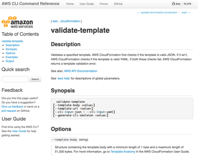

# My AWS Playground
My AWS playground to keep learning new AWS concepts.

## Table of Contents

- [My AWS Playground](#my-aws-playground)
  - [Table of Contents](#table-of-contents)
  - [**AWS: 7 Vital Concepts](#aws-7-vital-concepts)
    <details>
    <summary>Click to expand!</summary>

    - [EC2](#ec2)
    - [S3](#s3)
    - [SQS](#sqs) 
    - [Load Balancers](#load-balancers)
    - [API Gateways](#api-gateways)
    - [Lambda Functions](#lambda-functions)
    - [Amazon VPC](#amazon-vpc)
  - [**IaC: What is it and what are the options**](#iac-what-is-it-and-what-are-the-options)
    <details>
    <summary>Click to expand!</summary>

    - [IaC: What is it](#iac-what-is-it)
    - [IaC: What are the options](#iac-what-are-the-options)
      - [CloudFormation](#cloudformation)
        - [CloudFormation: Introduction](#cloudformation-introduction)  
      - [Terraform](#terraform)
        - [Terraform: Introduction](#terraform-introduction)  
      - [CDK](#cdk)
        - [CDK: Introduction](#cdk-introduction)
      - [Terraform vs CloudFormation vs AWS CDK](#terraform-vs-cloudformation-vs-aws-cdk)
      - [Other IaC tools and Terraform alternatives](#other-iac-tools-and-terraform-alternatives)
  - [**IaC: Unit Testing**](#iac-unit-testing)
    <details>
    <summary>Click to expand!</summary>

    - [IaC: How to Unit Test?](#iac-how-to-unit-test)
      - [CloudFormation: Unit Testing](#cloudformation-unit-testing)
        - [CloudFormation: Demo](#cloudformation-demo)
        - [CloudFormation: Unit Tests](#cloudformation-unit-tests)
      - [Terraform: Unit Testing](#terraform-unit-testing)
        - [Terraform: Demo](#terraform-demo)
        - [Terraform: Unit Tests](#terraform-unit-tests)      
      - [CDK: Unit Testing](#cdk-unit-testing)
        - [CDK: Demo](#cdk-demo)
        - [CDK: Unit Tests](#cdk-unit-tests)      

## **AWS: 7 Vital Concepts**

Let’s face it, AWS can make you pull your hair out if you don’t understand what’s happening.

Scratch that, that’s programming in general.

What I’m about to share with you is basically what I wish I knew 4 years ago when I was working at a company as the only dev and they told me these exact words:

> “Hey V, We’ve decided to move to AWS, and the old dev quit, can you help”
>

Seems like a straightforward sentence, but what followed was a lot of stress. Stress because as someone who always did front end and some backend work, I wasn’t fully aware of deployment infrastructures or devops systems.
      
So this quick, and (what I think) simple guide, is to give you, an overview of AWS (conceptually) that I wish I had when I started — this is not a setup tutorial (that will come later).
      
### EC2

This is one of the building blocks of AWS. You will definitely interact with an EC2 instance at some point in your AWS journey provided you’re not going completely serverless (more on this later).

EC2 stands for Elastic Cloud Compute, and it’s an AWS service that provides you with a server (like a box, a MacBook without a screen) to run your application. You get to decide all sorts of configurations, memory, box size and power. But in short, it is a server with a public IP address (if you want it to be public) as well as an HTTP address

Once you build an EC2 instance, you can access it by SSHing into the box, i.e the equivalent of username and password into the server. Once inside you can do anything you want in a server

  * Run node jobs
  * Do a hello world application
  * Launch a server
  * Route your server localhost:3000 to the outside world using NGINX

PS if you’re wondering how the configuration is set up, AWS has this concept called Amazon Machine Images, which are basically “blueprints” for server configurations

You might wonder, who decides what data goes in/out of the server and this is dependant upon the security group your EC2 belongs to as well as the VPC ACL (this will be in a follow up blog)

PPS: With EC2 you can also run a “spot server”, let’s say you want to do a job once a week but don’t want to pay for the server the whole time, a spot server basically turns on, charges you for the time it’s operating, performs the task and then turns off. Saving you $$$.
      
### S3

S3 is fantastic if you treat it right. Amazon S3 stands for Amazon Simple Storage Service (hope you’re picking up their vibe with numbers in the abbreviations)

S3 is a programmatic dropbox. You can upload photos, videos, JSON, gzips, entire frontend web projects and let it get served via a public URL. It is also used for holding versions of your server when you’re trying to auto-deploy your server using github or bitbucket (more on this later) — basically, it can host a heap of different s**t

The most common uses I’ve had for S3 have been 2 fold. One to host assets uploaded by users (if your customers upload a profile photo etc for example) and the second to serve my actual frontend website.

See S3 has this magical feature where it lets you upload the (for eg) the dist file of your Vue/React/Angular project into an S3 bucket and serve it to your customers. You can do this quite literally by routing your S3 URL (which they create for you automatically) with a CNAME you set up on godaddy or any hosting service.

In order for you to “Authenticate” or “secure (put https)” your S3 bucket website URL, you’ll need to associate it with something called CloudFront (I know, F me so many things) which is Amazons CDN network, this service allows for you connect your actual custom domain “banana.com” to the S3 bucket by providing the S3 bucket as an “origin”.

I won’t go into the benefits of a CDN, so if your S3 bucket is a public-facing bucket, I wouldn’t see why you wouldn’t make it part of a CDN network (content delivery network) to pace up asset delivery

### SQS

Amazon has its own service (of course) for message queues. If you’re not completely aware of what a message queue is, here’s my way of understanding it.

If you’ve ever stood in line at a McDonalds, you see this little holding area where there are bags of food sitting around waiting to be distributed by a staff member.

That is the queue, and the message (i.e the food) can only be processed once (i.e once a message to make food, or once the food is given to the customer, that’s it)

Message queues are a form of async communication, the main role of Message Queues is to batch large loads of work, smoothen spiky workloads, and decouple heavyweight tasks (large cron job processing)


Queue services are used extensively in modern architecture to speed up application build and also simplify the process of building apps. Modern-day builds include several micro-services that are isolated from each other and SQS allows for data to be transferred from a producer (the one sending a message) to the consumer (the receiver) in fast and effective way. Since its async, there are no “thread blockages” that happen therefore stopping the entire service.

Going back to the McDonalds example, imagine how crap the service would be if only one order can be delivered at a time, and until one order is delivered the other can begin.

The process effectively works by sending and receiving message signals, the producer sends a message by adding a task to the queue (putting an order on the delivery table at an McDs) the message sits on that table until a receiver takes the message and does something with it (give it to the customer)

You might ask, okay how does this work when there are one producer and many receivers, this is called a Pub/Sub system (Publish/Subscribe)

An example would be, if a sale is made on a Shopify store, there would be multiple services hooked into that “topic of a sale” to perform multiple, different/isolated tasks. For eg. Send a Slack notification to the shop owner, print out an order label, trigger an email sequence.

### Load Balancers

The name says it all, a Load Balancer’s job is to sit on top of a network of (for this example) EC2 boxes and check to see if each server is currently on overload or not.

If a server is on overload, the job of the load balancer is to divert traffic to the next closest available server.

You might wonder, wait what if I have an open socket with a server behind the load balancer, how is that session magically maintained/transferred across to a whole new server running in parallel. The answer is if you do have situations like this, AWS Application Load Balancer is smart enough to sustain ongoing sessions (Just need to tick the make it sticky checkbox when creating a load balancer)

Another use case of load balancers is that they provide you with a SSL certified endpoint (don’t need to add your own at least during testing), you can expose this route via a CNAME or a Masked route ( https://server.myapp.com). At this point, you need to make sure your EC2 instances are only accessible internally (i.e remove any external IP access), this will make sure that any security threat is isolated to minimal points of entry

### API Gateways

I learnt of API gateways during my quest to set up an SSL for an EC2 server. The first attempt was painful, I tried doing it within the EC2 instance, I was breaking my head (in hindsight, I overcomplicated things) but as a happy surprise, I came to learn of API gateways.

Think of an API gateway as a proxy, i.e its the middleman that receives your requests, do something to it if you want, and then sends that request to someone else you have no clue about.

There are many use-cases for API Gateways, but the 2 I’m mentioning, in particular, are acting as a secure proxy for an EC2 instance and second, wrapping a request with auth tokens.

Have you ever had that experience where you might need to make a request from the front end to a 3rd-party service, but the only way you can access that service is by adding to the request header an auth token, but that auth token is sensitive. You might think you need to go ahead and build an entire server to receive these requests, amend it and then send it to the 3rd party API. That’s a very painful way, an easier way is using an API gateway, where it gives you the capability to mutate the request (in a limited way) before you send it off to the 3rd party API.

### Lambda Functions

AWS Lambda functions let you run “functions” in the cloud without needing to maintain a server. The function executes your code only when you need it to (certain time of day, or when it receives a request from somewhere) and it can scale really fast!

The common use I’ve seen is mainly to respond to changes in your DB, react to HTTP requests it receives from AWS API gateway.

So you can treat lambda functions as part of a “serverless” architecture.

Supply the code to a lambda function, tell it what event it needs to react to and let it run free.

### Amazon VPC

A Virtual Private Cloud is a private cloud within AWS’ public cloud. Think of it as your own little office space inside a WeWork (LOL) which is publically accessible to everyone

Within that room, you’ve got own systems set up your own processes and communication layer, however, it can only be accessed via a restricted endpoint i.e the front-door.
      
**[⬆ back to top](#table-of-contents)**

## **IaC: What is it and what are the options**

### IaC: What is it

Infrastructure as code (IaC) helps organizations achieve their DevOps goals of automation and self-service by maintaining declaration files in version control that define your application environments. This practice supports programmatic build, configuration, and destruction of environments while enabling self-service, reducing errors, and eliminating time-consuming rollbacks.

### IaC: What are the options](#iac-what-are-the-options)

IT teams have two AWS-native options for infrastructure as code -- AWS CloudFormation and the AWS Cloud Development Kit (CDK).

  * **AWS CloudFormation:** CloudFormation templates were AWS' first foray into cloud-based infrastructure as code, and while still useful, CloudFormation has clear weaknesses. More specifically, it doesn't offer built-in logic capabilities and has a steep learning curve.

  * **AWS CDK:** The AWS CDK, an open source software development framework to define cloud infrastructure, addresses these weaknesses. The AWS CDK supports popular programming languages, which developers can use to build, automate and manage infrastructure based on an imperative approach.

  * **Terraform:** Terraform was introduced in 2014, with the goal of being able to orchestrate infrastructure as code. It first targeted AWS but has grown to be able to manage a large ecosystem of modules.  In fact, the capability of multi-provider support is one of the main selling points of the technology. Terraform introduced its own DSL, called Hashicorp Configuration Language (HCL). On the surface, it feels like a more human-friendly JSON. JSON is also natively supported within Terraform if you have a masochistic side.

#### CloudFormation

CloudFormation (CFN) is the original IaC tool for AWS, released in 2011. I have come to respect, hate, love, and revere its power to describe and manage infrastructure. CFN was originally only offered in JSON, but we were finally treated to a heaping helping of tabs vs spaces actually mattering with [native CFN YAML support in 2016](https://www.trek10.com/blog/cloudformation-yaml-and-why-its-awesome).

##### CloudFormation: Introduction

CloudFormation is one of the safest ways to build, manage, change, and destroy resources in your infrastructure. It offers robust resource state management, and these days it can tell you what is going to [happen before you run your deployment](https://docs.aws.amazon.com/AWSCloudFormation/latest/UserGuide/using-cfn-updating-stacks-changesets.html).

A lot of great features have worked to make CloudFormation more enjoyable or productive to work with over the years.

**CloudFormation Macros & Transforms**

One of the more powerful concepts, bringing whole new capabilities to essentially add your own opinionated capabilities to CloudFormation. For example, Trek10 provides a macro that lets you [write Step Function Amazon States Language (ASL) with pure yaml](https://github.com/trek10inc/sfn-yaml-macro) and smartly resolves CFN intrinsic functions.

You could imagine being able to provide opinionated IAM policy generators or S3 bucket resource macros. Whatever you want to do, macros can likely get you there. Take note, while powerful, you are treading dangerous territory as it becomes easy to effectively build your own Domain Specific Language. Instead of CloudFormation managing your resources, you are using CloudFormation as a bad Domain-Specific Language compiler that you have to babysit.

**Resource Providers**

For a while, we only had Custom Resources to provision and manage resources that CloudFormation didn’t natively support. This is now largely superseded by Resource Providers which allow you to create private or published providers to bring the management of third party and unsupported resources into your stacks. For example, Datadog, a popular monitoring tool can be used in your stack to provision and manage your monitoring without needing some out-of-band process.

___In most of my recent work with CFN, I’ve defaulted to using the AWS Serverless Application Model, or [SAM](https://aws.amazon.com/serverless/sam/). SAM is a superset of CFN, with some handy transformations that let you do a bit less typing and wiring up of various resources and permissions. Think of it like a well thought out and “managed” macro. If you are doing anything with AWS Lambda or event-driven computing and looking to level up your YAML wrangling, start with SAM.___

#### Terraform

Terraform was introduced in 2014, with the goal of being able to orchestrate infrastructure as code. It first [targeted AWS](https://github.com/hashicorp/terraform/commit/d6d5a97ec9cd08658e015ca83b34da3795e199ad) but has grown to be able to manage a [large ecosystem of modules](https://registry.terraform.io/).  In fact, the capability of multi-provider support is one of the main selling points of the technology.
  
##### Terraform: Introduction

**HCL**

Terraform introduced its own DSL, called [Hashicorp Configuration Language](https://github.com/hashicorp/hcl) (HCL). On the surface, it feels like a more human-friendly JSON. JSON is also natively supported within Terraform if you have a masochistic side.

> HCL is a powerful configuration language that helps use Terraform to the highest potential!
>

**Terraform vs CloudFormation**

AWS Infrastructure as Code is just fancy state management. The biggest difference between Terraform and CloudFormation is how it actually interacts with the infrastructure itself. CloudFormation you can hand a representation of your goal state, and it will perform all the operations on your infrastructure to get there for you natively within the platform. Terraform likewise takes the representation of your goal state, and [constructs a plan](https://www.terraform.io/docs/commands/plan.html) of API calls directly to your AWS infrastructure to get to that state.

**Why use Terraform over CloudFormation?**

In a perfect world, both approaches work flawlessly. But this is the cloud we are talking about. [Everything fails all the time](https://www.allthingsdistributed.com/2016/03/10-lessons-from-10-years-of-aws.html) as Werner Vogels says. Until recently, Terraform was superior in terms of being able to recover from people going outside the process to update resources.

Terraform was able to resolve inconsistencies and refresh a correct state of the infrastructure even if someone had manually edited that security group “just to test something”. CloudFormation struggled with these inconsistent states, but the introduction of [Drift Detection](https://aws.amazon.com/blogs/aws/new-cloudformation-drift-detection/) attempted to solve some of this headache.

**Even if you didn’t start with IaC, you can move to it**

Terraform also still offers the more elegant story of [importing](https://www.terraform.io/docs/import/index.html) unmanaged resources, or resources from other stacks. CloudFormation offers this, but only for the subset of resources that support drift detection.

In addition to these benefits, Terraform on AWS is really the one true option for “learn once, utilize most places”. Regardless of your feelings on multi-cloud or hybrid-cloud, the appeal of training up yourself or staff on a singular technology that can benefit from knowledge transfer across many different possible targets is tempting.

#### CDK

AWS Cloud Development Kit (CDK) is the new kid on the block, released in 2019. Using familiar programming languages and provided libraries in TypeScript, Python, Java and .NET developers can write with the same code as the rest of their stack to manage their infrastructure.

##### CDK: Introduction

CDK, however, is not devoid of CloudFormation. In fact, CDK synthesizes to CloudFormation. You still leverage all the state management and inherent benefits (and downsides) of CloudFormation by adopting CDK.

A quick aside: I do want to highlight that some folks view CFN as the “assembly language” of AWS, largely because of how many tools “compile” down to CFN. I think this is a dangerous comparison. It can lead to the interpretation that, like any high-level language to assembly, you don’t really need to understand how the lower-level instruction set works to effectively leverage the higher-level constructs. In my experience, this is patently untrue in the case of CFN. Even a rudimentary understanding of CFN leads to better decisions in the higher level usages like CDK.

Ultimately, I would contend that **CDK is the most comfortable and natural entry point for developers to start building Cloud Native applications**. 

**Constructs**

One of the particularly powerful features of CDK that I believe CloudFormation has struggled to natively deliver is the idea of truly shareable and reusable modules. CDK has introduced the concept of [constructs](https://docs.aws.amazon.com/cdk/latest/guide/constructs.html).
Constructs in practice provide everything from simple wrappings of some specific defaults you would like to re-use across your project all the way to complex multi-resource orchestration and wrapping of [resource providers](https://docs.aws.amazon.com/cloudformation-cli/latest/userguide/resource-types.html).
The distribution method for these constructs then relies on the native

The other important part of CDK Constructs is something neat called [jsii](https://github.com/aws/jsii).
To quote the project; “jsii allows code in any language to naturally interact with JavaScript classes. It is the technology that enables the AWS Cloud Development Kit to deliver polyglot libraries from a single codebase!”.
If you write your constructs with TypeScript, it is fairly straight forward to distribute and utilize those constructs across the other core CDK languages – further encouraging sharing of modules.

One of the most elegant ways I can illustrate how nice the CDK experience can be is to put a side-by-side comparison of the usage of [Amazon States Language](https://docs.aws.amazon.com/step-functions/latest/dg/concepts-amazon-states-language.html) (ASL).

First what it looks like in CloudFormation Native ASL:

```json
{
  "DeliveryStepFunctionStateMachine": {
    "Type": "AWS::StepFunctions::StateMachine",
    "Properties": {
      "RoleArn": {
        "Fn::GetAtt": ["DeliveryStepFunctionStateMachineRoleC6479370", "Arn"]
      },
      "DefinitionString": {
        "Fn::Join": [
          "",
          [
            "{\"StartAt\":\"MapperTask\",\"States\":{\"MapperTask\":{\"Next\":\"SetStatusTo-pending\",\"Retry\":[{\"ErrorEquals\":[\"States.ALL\"],\"MaxAttempts\":10}],\"Parameters\":{\"FunctionName\":\"",
            {
              "Ref": "DeliveryStepFunctionMapper"
            },
            "\",\"Payload.$\":\"$\"},\"OutputPath\":\"$.Payload\",\"Type\":\"Task\",\"Resource\":\"arn:",
            {
              "Ref": "AWS::Partition"
            },
            ":states:::lambda:invoke\"},\"SetStatusTo-pending\":{\"Next\":\"retry seconds\",\"Type\":\"Task\",\"ResultPath\":null,\"Resource\":\"arn:",
            {
              "Ref": "AWS::Partition"
            },
            ":states:::dynamodb:updateItem\",\"Parameters\":{\"Key\":{\"pk\":{\"S.$\":\"$.pk\"},\"sk\":{\"S.$\":\"$.sk\"}},\"TableName\":\"",
            {
              "Ref": "PersistenceDDBTable"
            },
            "\",\"ExpressionAttributeNames\":{\"#status\":\"status\"},\"ExpressionAttributeValues\":{\":status\":{\"S\":\"pending\"}},\"ReturnValues\":\"ALL_NEW\",\"UpdateExpression\":\"SET #status = :status\"}},\"retry seconds\":{\"Type\":\"Wait\",\"SecondsPath\":\"$.retrySeconds\",\"Next\":\"SetStatusTo-in-progress\"},\"SetStatusTo-in-progress\":{\"Next\":\"DeliverTransactionTask\",\"Type\":\"Task\",\"ResultPath\":null,\"Resource\":\"arn:",
            {
              "Ref": "AWS::Partition"
            },
            ":states:::dynamodb:updateItem\",\"Parameters\":{\"Key\":{\"pk\":{\"S.$\":\"$.pk\"},\"sk\":{\"S.$\":\"$.sk\"}},\"TableName\":\"",
            {
              "Ref": "PersistenceDDBTable"
            },
            "\",\"ExpressionAttributeNames\":{\"#status\":\"status\"},\"ExpressionAttributeValues\":{\":status\":{\"S\":\"in-progress\"}},\"ReturnValues\":\"ALL_NEW\",\"UpdateExpression\":\"SET #status = :status\"}},\"DeliverTransactionTask\":{\"Next\":\"Delivery success?\",\"Retry\":[{\"ErrorEquals\":[\"States.ALL\"],\"MaxAttempts\":10}],\"Parameters\":{\"FunctionName\":\"",
            {
              "Ref": "DeliveryStepFunctionDeliverTransaction"
            },
            "\",\"Payload.$\":\"$\"},\"OutputPath\":\"$.Payload\",\"Type\":\"Task\",\"Resource\":\"arn:",
            {
              "Ref": "AWS::Partition"
            },
            ":states:::lambda:invoke\"},\"Delivery success?\":{\"Type\":\"Choice\",\"Choices\":[{\"Variable\":\"$.status\",\"StringEquals\":\"complete\",\"Next\":\"SetStatusTo-complete\"},{\"Variable\":\"$.status\",\"StringEquals\":\"failed\",\"Next\":\"SetStatusTo-failed\"}],\"Default\":\"SetStatusTo-pending\"},\"SetStatusTo-complete\":{\"End\":true,\"Type\":\"Task\",\"ResultPath\":null,\"Resource\":\"arn:",
            {
              "Ref": "AWS::Partition"
            },
            ":states:::dynamodb:updateItem\",\"Parameters\":{\"Key\":{\"pk\":{\"S.$\":\"$.pk\"},\"sk\":{\"S.$\":\"$.sk\"}},\"TableName\":\"",
            {
              "Ref": "PersistenceDDBTable"
            },
            "\",\"ExpressionAttributeNames\":{\"#status\":\"status\"},\"ExpressionAttributeValues\":{\":status\":{\"S\":\"complete\"}},\"ReturnValues\":\"ALL_NEW\",\"UpdateExpression\":\"SET #status = :status\"}},\"SetStatusTo-failed\":{\"End\":true,\"Type\":\"Task\",\"ResultPath\":null,\"Resource\":\"arn:",
            {
              "Ref": "AWS::Partition"
            },
            ":states:::dynamodb:updateItem\",\"Parameters\":{\"Key\":{\"pk\":{\"S.$\":\"$.pk\"},\"sk\":{\"S.$\":\"$.sk\"}},\"TableName\":\"",
            {
              "Ref": "PersistenceDDBTable"
            },
            "\",\"ExpressionAttributeNames\":{\"#status\":\"status\"},\"ExpressionAttributeValues\":{\":status\":{\"S\":\"failed\"}},\"ReturnValues\":\"ALL_NEW\",\"UpdateExpression\":\"SET #status = :status\"}}}}"
          ]
        ]
      }
    }
  }
}
```

Then with AWS CDK (leveraging some existing constructs to handle editing the Amazon DynamoDB records for me):

```TypeScript
const STATUS = "$.status"
const RETRY_SECONDS = "$.retrySeconds"
const PENDING = "pending"
const PROGRESS = "in-progress"
const FAILED = "failed"
const COMPLETE = "complete"

const setPending = stepFunction.setStatus(this, props.table, PENDING);
const setProgress = stepFunction.setStatus(this, props.table, PROGRESS);
const setSuccess = stepFunction.setStatus(this, props.table, COMPLETE);
const setFailed = stepFunction.setStatus(this, props.table, FAILED);
const waitForNSeconds = this.waitTask("retry seconds", RETRY_SECONDS);

const definition = this.mapperTask()
  .next(setPending)
  .next(waitForNSeconds)
  .next(setProgress)
  .next(this.deliverTransactionTask())
  .next(
    new sfn.Choice(this, "Delivery success?")
      .when(sfn.Condition.stringEquals(STATUS, COMPLETE), setComplete)
      .when(sfn.Condition.stringEquals(STATUS, FAILED), setFailed)
      .otherwise(setPending)
  );
```

If you had to read the second code snippet to understand what the first was doing, I’d completely understand. Granted, there is nothing stopping CloudFormation from adopting and supporting a more elegant DSL.
In fact, [AWS SAM](https://aws.amazon.com/serverless/sam/) is really an attempt at exactly this with a focus on the serverless developer experience. 

Given the current community momentum around CDK and growing investment from AWS, I expect to see more and more teams starting with CDK and happily continuing with it as their primary utility for infrastructure management.

#### Terraform vs CloudFormation vs AWS CDK

| <!-- -->                                                                                    | <!-- -->                                                |
|---------------------------------------------------------------------------------------------|---------------------------------------------------------|
| Am I working on a simple, mostly serverless solution with minimal dependency or dependents? | CloudFormation (particularly AWS SAM) is likely enough. |
| Do I have a top-down distribution of best practices and orchestration?	                  | CDK or Terraform                                        |
| Do I want to stay entirely within the AWS ecosystem?	                                      | CloudFormation or CDK                                   |
| Do I need to orchestrate resources outside the AWS ecosystem?	                              | Terraform or CDK for Terraform                          |
| Do I want a multi-provider utility, especially for multi/hybrid cloud knowledge transfer?	  | Terraform                                               |

Choosing the right IaC tool on AWS

The only truly wrong answer is the one that prevents you from building anything at all.

#### Other IaC tools and Terraform alternatives

The IaC space is growing, everyone has their own opinion and how things should work.
I’d argue competition is healthy and in some cases has forced the providers themselves to step their game up.

| <!-- -->             | <!-- -->                                                                                                                                                                                                                                                                                                                         |
|----------------------|----------------------------------------------------------------------------------------------------------------------------------------------------------------------------------------------------------------------------------------------------------------------------------------------------------------------------------|
| AWS Amplify CLI	   | A CLI toolchain for simplifying serverless web and mobile development. If you are primarily a frontend developer, or just want to get going as fast as possible, look no further. The Amplify CLI and framework manages all the complexity behind the scenes to help you build and deploy real-time web and mobile applications. |
| Pulumi	           | If the Terraform and CDK teams got together and reimagined things, I get the sense it would look a bit like Pulumi.                                                                                                                                                                                                              |
| Troposphere	       | The troposphere library allows for easier creation of the AWS CloudFormation JSON by writing Python code to describe the AWS resources. Troposphere also includes some basic support for OpenStack resources via Heat.                                                                                                           |
| InGraph	           | InGraph is an open-source and declarative, infrastructure graph DSL for AWS CloudFormation. The key feature is the ability to create composable infrastructure components while preserving the rigorous semantic of the AWS CloudFormation language.                                                                             |
| Serverless Framework | Zero-friction serverless development. Easily build apps that auto-scale on low cost, next-gen cloud infrastructure.                                                                                                                                                                                                              |

**[⬆ back to top](#table-of-contents)**
      
## **IaC: Unit Testing**      

### IaC: How to Unit Test?

**CloudFormation: Unit Testing**

The [AWS QuickStart](https://aws.amazon.com/quickstart/?quickstart-all.sort-by=item.additionalFields.updateDate&quickstart-all.sort-order=desc) team open sourced a project they use for automated testing of CloudFormation templates called [TaskCat](https://github.com/aws-quickstart/taskcat). 
With TaskCat, you can run automated tests to learn of and fix any errors that arise in your CloudFormation templates.

If you have been using CloudFormation for any period of time, you will learn that even if you have not made any changes to your templates, they might still fail. As one of my colleagues is fond of saying, if you haven’t run your CloudFormation template in the past week, it’s broken. This is typical of most software systems in which there are often version, configuration, API, or other changes to dependencies that can affect the operation of the CloudFormation template(s).

**CDK: Unit Testing**

The pattern for writing tests for infrastructure is very similar to how you would write them for application code: you define a test case as you would normally 
do in the test framework of your choice. Inside that test case you instantiate constructs as you would do in your CDK app, and then you make assertions 
about the [AWS CloudFormation](https://aws.amazon.com/cloudformation/) template that the code you wrote would generate.

The one thing that’s different from normal tests are the assertions that you write on your code. The TypeScript CDK ships with an assertion library ([@aws-cdk/assert](https://github.com/aws/aws-cdk/tree/master/packages/%40aws-cdk/assert)) 
that makes it easy to make assertions on your infrastructure. In fact, all of the [constructs](https://docs.aws.amazon.com/cdk/latest/guide/constructs.html) 
in the [AWS Construct Library](https://docs.aws.amazon.com/cdk/api/latest/docs/aws-construct-library.html) that ship with the CDK are tested in this way,
so we can make sure they do—and keep on doing—what they are supposed to do.
Our assertions library is currently only available to TypeScript and JavaScript users, but will be made available to users of other languages eventually.

Broadly, there are a couple of classes of tests you will be writing:

  * **Snapshot tests** (also known as “golden master” tests). Using Jest, these are very convenient to write. They assert that the CloudFormation template the code generates is the same as it was when the test was written. If anything changes, the test framework will show you the changes in a diff. If the changes were accidental, you’ll go and update the code until the test passes again, and if the changes were intentional, you’ll have the option to accept the new template as the new “golden master”.
    * In the CDK itself, we also use snapshot tests as “integration tests”. Rather than individual unit tests that only look at the CloudFormation template output, we write a larger application using CDK constructs, deploy it and verify that it works as intended. We then make a snapshot of the CloudFormation template, that will force us to re-deploy and re-test the deployment if the generated template starts to deviate from the snapshot.
  * **Fine-grained assertions about the template.** Snapshot tests are convenient and fast to write, and provide a baseline level of security that your code changes did not change the generated template. The trouble starts when you purposely introduce changes. Let’s say you have a snapshot test to verify output for feature A, and you now add a feature B to your construct. This changes the generated template, and your snapshot test will break, even though feature A still works as intended. The snapshot can’t tell which part of the template is relevant to feature A and which part is relevant to feature B. To combat this, you can also write more fine-grained assertions, such as “this resource has this property” (and I don’t care about any of the others).
  * **Validation tests.** One of the advantages of general-purpose programming languages is that we can add additional validation checks and error out early, saving the construct user some trial-and-error time. You would test those by using the construct in an invalid way and asserting that an error is raised.

**Terraform: Unit Testing**

New Context released its first open-source project, [kitchen-terraform](https://github.com/newcontext/kitchen-terraform).
kitchen-terraform was created to bring the benefits of test-driven development to [Terraform](https://terraform.io/) projects.
As use of Terraform continues to gain popularity in production environments, it is critical that this logic is thoroughly tested.
kitchen-terraform allows Terraform development to be driven by a suite of tests to verify new features and protect against regressions.

#### CloudFormation: Unit Testing

We will now see an example of how I am enabling TaskCat to run from AWS CodeBuild as part of a deployment pipeline defined in AWS CodePipeline. What’s more, you will see how to automate the solution in AWS CloudFormation. Using this approach, you can configure TaskCat to run with every code change and learn when errors occur in your CloudFormation templates.

I’ve also included a screencast below that provides a walkthrough of the steps covered in this post.

[](https://www.youtube.com/watch?v=tB8nK5d_SKY "Run AWS CloudFormation tests from CodePipeline using TaskCat")


**Run TaskCat from the Command Line**

In this section, you will learn how to use manually run TaskCat automated tests on CloudFormation templates from the command line.

TaskCat is provided as a Python package that you will download. This example assumes you have access to an AWS account and have established the necessary permissions.
In order to show specific directory names, it also assumes you are using [AWS Cloud9](https://stelligent.com/2018/04/09/automating-aws-cloud9/) for your IDE.
If you are not, you should be able to simply modify the directory names accordingly.

**Install Python and TaskCat**

TaskCat uses Python 3 so you will need to install Python, pip (the package installer for Python), and TaskCat via pip in AWS Cloud9.

Here are the instructions for installing these tools using the Cloud9 terminal:

```bash
cd ~/environment
sudo yum -y update
python --version
curl -O https://bootstrap.pypa.io/get-pip.py
python3 get-pip.py --user
sudo pip install --upgrade pip
pip3 install taskcat --user
```

To verify TaskCat is installed, type `taskcat --version` from the command line. You should see something like this returned from the command line:

```bash
taskcat --version

 _            _             _   
| |_ __ _ ___| | _____ __ _| |_ 
| __/ _` / __| |/ / __/ _` | __|
| || (_| \__ \    (_| (_| | |_ 
 \__\__,_|___/_|\_\___\__,_|\__|
                                


version 0.9.8
0.9.8
```

For the purposes of these examples, I am assuming you are using version `0.9` or above.

**Configure TaskCat**

You can run TaskCat in several ways and there are a few command line options that the tool provides. I will take you through a simple example that is currently running on an open source repository that I own.

**Create a new GitHub repository**

In this section, you will create a new GitHub repository to store a CloudFormation so that you can run TaskCat against this and other CloudFormation templates.

Here are the steps for creating a new repository in GitHub:

  1. In the upper-right corner of any page on [GitHub](https://github.com/), use the drop-down menu, and select **New repository**.
  1. Type `taskcat-example` as the name for your repository.
  1. Type `Repository to run TaskCat examples.` for the description of your repository.
  1. Choose to make the repository either public or private.
  1. Select **Initialize this repository with a README**.
  1. Click **Create repository**.

For more information, see [Create a repo](https://help.github.com/en/github/getting-started-with-github/create-a-repo).

**Clone the Repository**

From your Cloud9 terminal, type the following (replacing **YOURGITHUBUSERID** with your GitHub userid):

```bash
cd ~/environment
git clone https://github.com/YOURGITHUBUSERID/taskcat-example.git
cd taskcat-example
```

**Create a .taskcat.yml file**

From your Cloud9 terminal, type the following:

```bash
cd ~/environment/taskcat-example
touch .taskcat.yml
```

**Create a CloudFormation Template**

From your Cloud9 terminal, type the following:

```bash
cd ~/environment/taskcat-example
touch sqs.yml
```

Open the `sqs.yml` and copy the contents below and save the file.

```yaml
---
AWSTemplateFormatVersion: '2010-09-09'
Description: Creates an SQS Queue.
Resources:
  MyQueue:
    Type: AWS::SQS::Queue
    Properties:
      QueueName:
        Fn::Join:
        - ''
        - - SampleQueue-
          - Ref: AWS::StackName
Outputs:
  MyQueueARN:
    Value:
      Ref: MyQueue
```

**Update .taskcat.yml**

From your Cloud9 terminal, copy and paste the following into your .taskcat.yml file and save the contents.

```yaml
project:
  name: taskcat-example
  regions:
    - us-east-1
    - us-east-2
tests:
  sqs-test:
    template: ./sqs.yml
```

This is the configuration file that TaskCat uses to know which CloudFormation templates to run and how to run them.
You can pass in parameters, use TaskCat tokens to generate passwords and other values, and perform other configuration.
Here’s an example of passing in a parameter to a CloudFormation template:

```yaml
tests:
  lesson5-ebs:
    parameters:
      AvailabilityZones: '$[taskcat_genaz_1]'
    template: ./lesson5-rest/ceoa-5-ebs.yml
```

`$[taskcat_genaz_1]` is a TaskCat token that obtains a single availability zone for a region 
(if I choose `$[taskcat_genaz_2]`, it selects two AZs). You use `parameters` to list the parameters and values 
when launching the CloudFormation stack. For more information on TaskCat tokens see [Preparing TaskCat input files](https://aws-quickstart.github.io/input-files.html).

**Run TaskCat**

From your Cloud9 terminal, type the following command to run TaskCat against your CloudFormation template.

```bash
taskcat test run
```

TaskCat will create and delete CloudFormation stacks for all the files listed in the .taskcat.yml file. In this example, it will create and delete a total of two stacks – one for each listed AWS region 
in the **.taskcat.yml**. When successful, the results will look similar to the image below.


Once it’s complete, you can open the **index.html** generated in the **taskcat_outputs** directory to view the TaskCat dashboard. 
To do this, right click on the **index.html** file in Cloud9 and click **Preview** on the context menu.
A web page should display that looks similar to the image below.


**Creating a Pipeline to Run TaskCat**

In this example, you will see how you can create a CloudFormation template that automatically provisions CodePipeline, 
a GitHub source provider, a CodeBuild project to run TaskCat, and another CodeBuild project to deploy the TaskCat dashboard. 
This way you can run TaskCat automatically without needing to manually type commands every time.

**Deployment Steps**

There are four main steps in launching this solution: prepare an AWS account, create and store source files, launch the CloudFormation stack, 
and test the deployment. Each is described in more detail in this section. Please note that you are responsible for any fees incurred 
while creating and launching your solution.

**Step 1. Prerequisites**

This example assumes you have access to an AWS account and have established the necessary permissions.

**Store your GitHub Personal Access Token in AWS Secrets Manager**

In order for CodePipeline to use GitHub as a source provider it needs your GitHub personal access token. Since we want to run all changes 
automatically and we want to be secure, you need to store this secret in an encrypted location. You will do this in AWS Secrets Manager. 
Here are the steps:

  1. Go to the [AWS Secrets Manager Console](https://console.aws.amazon.com/secretsmanager/).
  1. Click **Secrets** and click the **Store a new secret** button.
  1. Click on the **Other type of secrets** radio button.
  1. Click on the **Plaintext** tab and enter the GitHub token value in the text area.
     You can get this token by going to [Personal access tokens](https://github.com/settings/tokens) and creating one or using an existing token.
	 To create a GitHub token, see the [instructions here](https://github.com/PaulDuvall/aws-encryption-workshop/wiki/0.2#create-an-oauth-token-in-github-optional).
  1. Leave the Select the *encryption key* dropdown with the **DefaultEncryptionKey** option selected.
  1. Click the **Next** button.
  1. Enter **github/personal-access-token** for the Secret name and description on the Secret name and description page and click Next.
  1. On the *Configure automatic rotation page*, select the **Disable automatic rotation** radio button.
  1. Click the **Next** button.
  1. On the **Review** page, click the **Store** button.

**Step 2. Create and Store Source Files**

Next, you will create two source files that will be committed to your GitHub repository. 
From your AWS Cloud9 terminal, type the following to create and save two empty source files:

```bash
touch buildspec.yml
touch pipeline-taskcat.yml
```

**buildspec.yml**

Copy the source contents from the **buildspec.yml** and save it to your local file of the same name in your Cloud9 environment. 
This file installs and configures Python, pip, and TaskCat. It also runs the TaskCat tests against the CloudFormation templates 
listed in the **.taskcat.yml** file. The **buildspec.yml** file is configured to run as part of a CodeBuild project defined in 
the **pipeline-taskcat.yml** CloudFormation template. In this template CodePipeline is configured to execute this CodeBuild project.

**pipeline-taskcat.yml**

Copy the source contents from the **pipeline-taskcat.yml** file and save it to your local file of the same name in your Cloud9 environment. 
This CloudFormation template provisions two CodeBuild projects, IAM Permissions, S3 Buckets, and a deployment pipeline in AWS CodePipeline. 
Once this CloudFormation stack is successfully launched, a pipeline will run in which CodeBuild will run CloudFormation tests in TaskCat, 
create a static website in S3, and copy the TaskCat dashboard files to this website.

There are a few things to note in this CloudFormation template. The default value for the **GitHubToken** parameter is configured as shown below. 
This assumes that you created the secrets in AWS Secrets Manager and used the name **github/personal-access-token**. If you have not, 
you will need to make changes for the CloudFormation template to work.

```
Default: '{{resolve:secretsmanager:github/personal-access-token:SecretString}}'
```

Also, there are two CodeBuild projects in this template. **CodeBuildTest** runs the TaskCat tests and is configured to run from the CodePipeline resource.
**CodeBuildWebsite** copies the files generated and stored in the **taskcat_outputs** folder to an S3 bucket and then configures the S3 bucket 
to be a public static website. CodePipeline is also configured to run this CodeBuild project.

This CloudFormation stack configures CodePipeline to run with ever GitHub change. If you’d rather run these tests on a scheduled basis, 
you will need to make changes to the configuration.

**Add and Commit the Source files to GitHub**

From your AWS Cloud9 terminal, type the following to add and commit files to your GitHub repository:

```bash
cd ~/environment/taskcat-example
git add .
git commit -am "add CloudFormation and CodeBuild files" && git push
```

**Step 3. Launch the Stack**

From your AWS Cloud9 environment, type the following (replacing **YOURGITHUBUSERID** with your GitHub userid):

```bash
aws cloudformation create-stack --stack-name pipeline-taskcat --capabilities CAPABILITY_NAMED_IAM --disable-rollback --template-body file:///home/ec2-user/environment/taskcat-example/pipeline-taskcat.yml --parameters ParameterKey=GitHubUser,ParameterValue=YOURGITHUBUSERID ParameterKey=GitHubRepo,ParameterValue=taskcat-example
```

**Step 4. Test the Deployment**

Verify the CloudFormation template has launched by going to the CloudFormation dashboard.

Once the stack is **CREATE_COMPLETE**, select it and click on the **Outputs** tab. It should look similar to the image below.


Now, click on the **PipelineUrl** Output. This will launch the pipeline you automatically provisioned in CodePipeline – as shown below.


Once it has successfully run through all the stages in the pipeline, you will click on the **TaskCatDashboardUrl** Output value. 
This launches a website containing the TaskCat dashboard. You can click on **View Logs** for additional detail.


**Additional Resources**

  * [Testing your QuickStart](https://aws-quickstart.github.io/testing.html)
  * [A deep dive into testing with TaskCat](https://aws.amazon.com/blogs/infrastructure-and-automation/a-deep-dive-into-testing-with-taskcat/)
  * [Up your AWS CloudFormation testing game using TaskCat](https://aws.amazon.com/blogs/infrastructure-and-automation/up-your-aws-cloudformation-testing-game-using-taskcat/)

##### CloudFormation: Demo

**Introduction**

When writing AWS CloudFormation in YAML or JSON, it is difficult to visually review the contents of the template, such as grammar and parameter types. 
Therefore, there are various tools to make it easier to test CloudFormation. 
In this section, we will introduce these tools and aim to define the introduction of the introduced tools in Dockerfile and reuse them.

**Tool introduction**

Tools range from those that come with the AWS CLI to those that are open source. I will introduce them one by one.

① aws cloudformation validate-template

  * You can use the aws cloudformation validate-template command to check if the specified template is valid JSON or YAML.
  * However, this command does not check the validity of the value, it only checks whether it is written in the correct grammar.



https://awscli.amazonaws.com/v2/documentation/api/latest/reference/cloudformation/validate-template.html

**Execution example**

```bash
bash-4.2# aws cloudformation validate-template --template-body file://./vpcsample-template.yaml 

An error occurred (ValidationError) when calling the ValidateTemplate operation: Template format error: YAML not well-formed. (line 26, column 17)
```

② cfn-lint

  * The official name is "AWS CloudFormation Linter"
  * Validate CloudFormation YAML and JSON templates according to resource specifications and additional check items.
  * Includes valid values ​​for properties, as well as checking best practices.


https://github.com/aws-cloudformation/cfn-python-lint

**Execution example**

```bash
bash-4.2# cfn-lint vpcsample-template.yaml
W3010 Don't hardcode ap-northeast-1a for AvailabilityZones
vpcsample-template.yaml:18:13
```

③ taskcat

  * Create a stack in parallel in multiple AWS Regions to test for deployment.
  * You can detect problems that cannot be detected by testing a single template or stack.
  * For example, you can find out if there are any services that are not supported in a particular region.
  * You can generate success/failure reports for each region.
  * Effective for checking when using CloudFormation Stack Sets.


https://github.com/aws-quickstart/taskcat

**.taskcat.yml sample**

```yaml
project:
   name: taskcat-example
   regions:
      - ap-northeast-1
      - us-east-1
   tests:
      vpcsample:
         template: ./vpcsample-template.yaml
```

**Execution example**

```bash
bash-4.2# taskcat test run 

version 0.9.20
[INFO   ] : Linting passed for file: /workspaces/awsdev/work/vpcsample-template.yaml
[S3: -> ] s3://tcat-taskcat-example-XXXXXXXXXXXXXX/taskcat-example/vpcsample-template.yaml
[INFO   ] : ┏ stack Ⓜ tCaT-taskcat-example-vpcsample-2a58141fb6114aed895774ebfcac9ed2                                        
[INFO   ] : ┣ region: ap-northeast-1                                                                                         
[INFO   ] : ┗ status: CREATE_COMPLETE                                                                                        
[INFO   ] : ┏ stack Ⓜ tCaT-taskcat-example-vpcsample-2a58141fb6114aed895774ebfcac9ed2                                        
[INFO   ] : ┣ region: us-east-1                                                                                              
[INFO   ] : ┗ status: CREATE_COMPLETE                                                                                        
[INFO   ] : Reporting on arn:aws:cloudformation:ap-northeast-1:XXXXXXXXXXXX:stack/tCaT-taskcat-example-vpcsample-2a58141fb6114aed895774ebfcac9ed2/7e9705c0-2747-11eb-861d-0aff14bc0982
[INFO   ] : Reporting on arn:aws:cloudformation:us-east-1:XXXXXXXXXXXX:stack/tCaT-taskcat-example-vpcsample-2a58141fb6114aed895774ebfcac9ed2/7fc94430-2747-11eb-bfb5-1246411399d1
[INFO   ] : Deleting stack: arn:aws:cloudformation:ap-northeast-1:XXXXXXXXXXXX:stack/tCaT-taskcat-example-vpcsample-2a58141fb6114aed895774ebfcac9ed2/7e9705c0-2747-11eb-861d-0aff14bc0982
[INFO   ] : Deleting stack: arn:aws:cloudformation:us-east-1:XXXXXXXXXXXX:stack/tCaT-taskcat-example-vpcsample-2a58141fb6114aed895774ebfcac9ed2/7fc94430-2747-11eb-bfb5-1246411399d1
[INFO   ] : ┏ stack Ⓜ tCaT-taskcat-example-vpcsample-2a58141fb6114aed895774ebfcac9ed2                                        
[INFO   ] : ┣ region: ap-northeast-1                                                                                         
[INFO   ] : ┗ status: DELETE_COMPLETE                                                                                        
[INFO   ] : ┏ stack Ⓜ tCaT-taskcat-example-vpcsample-2a58141fb6114aed895774ebfcac9ed2                                        
[INFO   ] : ┣ region: us-east-1                                                                                              
[INFO   ] : ┗ status: DELETE_COMPLETE
```

**Report sample (text)**

```bash
bash-4.2# cat tCaT-taskcat-example-vpcsample-2a58141fb6114aed895774ebfcac9ed2-ap-northeast-1-cfnlogs.txt
-----------------------------------------------------------------------------
Region: ap-northeast-1
StackName: tCaT-taskcat-example-vpcsample-2a58141fb6114aed895774ebfcac9ed2
*****************************************************************************
ResourceStatusReason:  
Stack launch was successful
*****************************************************************************
*****************************************************************************
Events:  
TimeStamp                         ResourceStatus      ResourceType                LogicalResourceId                                                ResourceStatusReason
--------------------------------  ------------------  --------------------------  ---------------------------------------------------------------  ---------------------------
2020-11-15 13:36:54.256000+00:00  CREATE_COMPLETE     AWS::CloudFormation::Stack  tCaT-taskcat-example-vpcsample-2a58141fb6114aed895774ebfcac9ed2
2020-11-15 13:36:52.656000+00:00  CREATE_COMPLETE     AWS::EC2::Subnet            TestSubnet01
2020-11-15 13:36:40.587000+00:00  CREATE_COMPLETE     AWS::EC2::Subnet            TestSubnet03
2020-11-15 13:36:40.280000+00:00  CREATE_COMPLETE     AWS::EC2::Subnet            TestSubnet02
2020-11-15 13:36:36.368000+00:00  CREATE_IN_PROGRESS  AWS::EC2::Subnet            TestSubnet01                                                     Resource creation Initiated
2020-11-15 13:36:35.712000+00:00  CREATE_IN_PROGRESS  AWS::EC2::Subnet            TestSubnet01
2020-11-15 13:36:24.163000+00:00  CREATE_IN_PROGRESS  AWS::EC2::Subnet            TestSubnet03                                                     Resource creation Initiated
2020-11-15 13:36:24.147000+00:00  CREATE_IN_PROGRESS  AWS::EC2::Subnet            TestSubnet02                                                     Resource creation Initiated
2020-11-15 13:36:23.594000+00:00  CREATE_IN_PROGRESS  AWS::EC2::Subnet            TestSubnet03
2020-11-15 13:36:23.442000+00:00  CREATE_IN_PROGRESS  AWS::EC2::Subnet            TestSubnet02
2020-11-15 13:36:21.092000+00:00  CREATE_COMPLETE     AWS::EC2::VPC               TestVPC
2020-11-15 13:36:04.224000+00:00  CREATE_IN_PROGRESS  AWS::EC2::VPC               TestVPC                                                          Resource creation Initiated
2020-11-15 13:36:03.612000+00:00  CREATE_IN_PROGRESS  AWS::EC2::VPC               TestVPC
2020-11-15 13:35:59.310000+00:00  CREATE_IN_PROGRESS  AWS::CloudFormation::Stack  tCaT-taskcat-example-vpcsample-2a58141fb6114aed895774ebfcac9ed2  User Initiated
*****************************************************************************
-----------------------------------------------------------------------------
Tested on: Sunday, 15. November 2020 01:37PM
```

**Report sample (HTML)**


④ cfn_nag

  * A tool for inspecting and displaying the following unsafe settings.
  * IAM rules (wildcards) that are too broad
  * Security group rules (wildcards) that are too wide tolerated
  * Unenabled access log
  * Unenabled encryption
  * Password strength


https://github.com/stelligent/cfn_nag

**Execution example**

```bash
bash-4.2# cfn_nag_scan --input-path vpcsample-template.yaml 
------------------------------------------------------------
vpcsample-template.yaml
------------------------------------------------------------------------------------------------------------------------
| WARN W60
|
| Resources: ["TestVPC"]
| Line Numbers: [5]
|
| VPC should have a flow log attached

Failures count: 0
Warnings count: 1
```

⑤ CloudFormation Guard

  * Checks if the template is described within the predetermined rules.
  * Write the rules in advance in the .ruleset file.
  * The cfn-guard command checks if YAML is written according to that rule.
  * It is good to use it to check the conformity with the project-specific or non-deviable conditions, such as making rules for the constraints set for each project or writing the design value agreed with the customer and using it for the final check. That's right.


https://github.com/aws-cloudformation/cloudformation-guard

**Execution example**

```bash
bash-4.2# cfn-guard check -t Examples/ebs_volume_template.json -r Examples/ebs_volume_template.ruleset

[NewVolume2] failed because [Encrypted] is [false] and the permitted value is [true]
[NewVolume] failed because [Encrypted] is [false] and the permitted value is [true]
[NewVolume] failed because [Size] is [500] and the permitted value is [<= 100]
Number of failures: 3
```

**Pack test tools into Dockerfile**

It can also be run with VSCode Remote Containers.

Also, since privilege is required to execute taskcat, let's move it by referring to the link below. This article is titled VSCode Remote Containers, but if you don't use VSCode Remote Containers, you can follow the steps up to the point of attachment. How to develop in a container with --privileged and/sbin/init passed in VSCode Remote Containers

```bash
# AWS CLI v2 (Official)
FROM amazon/aws-cli:latest

# To install Visual Studio Code Server
# and modules
RUN yum -y update && \
    yum -y install tar gzip git

# To install pip
RUN curl -kL https://bootstrap.pypa.io/get-pip.py | python

# To install cfn-lint
RUN pip install cfn-lint

# To install taskcat
RUN yum -y install python3 && \
    pip3 install taskcat

# To install docker (for taskcat)
RUN amazon-linux-extras install -y docker

# To install cfn-nag & CloudFormation Guard
RUN yum -y install bzip2 gcc make openssl-devel && \
    git clone https://github.com/sstephenson/rbenv.git ~/.rbenv && \
    echo 'export PATH="$HOME/.rbenv/bin:$PATH"' >> ~/.bash_profile && \
    echo 'eval "$(rbenv init -)"' >> ~/.bash_profile && \
    source ~/.bash_profile && \
    git clone git://github.com/sstephenson/ruby-build.git ~/.rbenv/plugins/ruby-build && \
    ~/.rbenv/plugins/ruby-build/install.sh && \
    rbenv install 2.7.2 && \
    rbenv global 2.7.2 && \
    gem install cfn-nag && \
    yum -y install wget && \
    wget https://github.com/aws-cloudformation/cloudformation-guard/releases/download/1.0.0/cfn-guard-linux-1.0.0.tar.gz && \
    tar -xvf cfn-guard-linux-1.0.0.tar.gz -C ~/

# To clean up
RUN yum clean all
```

**Points that made a decision when creating a Dockerfile**

I think the point is which container image to put in `FROM`, but this time I chose `amazon/aws-cli: latest`. 
This image is the official AWS CLI v2 Docker image. Reference: [Using Official AWS CLI Version 2 Docker Image](https://docs.aws.amazon.com/ja_jp/cli/latest/userguide/install-cliv2-docker.html).

I chose this image because I thought it would be better to use the official image to get support related to the AWS CLI.

However, instead, installing and running cfn-nag requires a rather tedious procedure to install Ruby. 
That said, if you use the image of ruby, installing the AWS CLI will be a little troublesome this time, 
so even if you consider the advantages and disadvantages, it was difficult to make a decision.

**Summary and for the future**

  * By automating mechanical inspections as much as possible, it is possible to perform tests that do not depend on human judgment and are not overlooked.
  * By combining multiple tools, you can test from different perspectives.
  * However, when it comes to checking the consistency between requirements and templates, there are still some difficulties.
  * When developing a waterfall model that SIer often does, it is checked whether the requirements of the previous process (basic design) and the contents of the template of the current process are consistent, but from this point of view, it is still difficult to inspect. , It can be said that it is a point that I would like to pursue in the future, including how much the recently released CloudFormation Guard can be used.

**References**
  * [YouTube: I'm in DevOps - Deep Dive: Infrastructure as Code on AWS (Level 300)](https://www.youtube.com/watch?v=YHdZYw3hXwE)
  * [Use Official AWS CLI Version 2 Docker Image](https://docs.aws.amazon.com/ja_jp/cli/latest/userguide/install-cliv2-docker.html)

##### CloudFormation: Unit Tests

  * **AWS CloudFormation - Simple S3 Bucket Example**
    * [AWS CloudFormation - Simple S3 Bucket Example - Blog Post](https://sep.com/blog/automated-testing-for-cloudformation-templates/)
    * [AWS CloudFormation - Simple S3 Bucket Example - Source Code](./IaC/cloudformation/single_s3_bucket_simple_example/README.md)
  * **AWS CloudFormation - Mongodb on VPC Example**
    * [AWS CloudFormation - Mongodb on VPC Example - Source Code](./IaC/cloudformation/mongodb_on_vpc_example/README.md)
  
#### Terraform: Unit Testing

**Writing simple unit test case for AWS infrastructure**

The more you write code regardless of application or infrastructure, the more you desire to bring the best outcome of your writing when they are running 
as a realtime entity. And no way to deny that testing helps us to gain our confidence before going for production. So, why leave your infrastructure 
code without testing? In this blog post, I am going to introduce writing unit tests for your infrastructure in AWS.

Infrastructure as a Code (IAAC) is a blessing to us all, which allows us to code our infrastructure configuration under version control. 
To reuse a particular piece of code over and over, you have to declare modules just as the same you declare objects in OOP. But what if the 
base configuration template is not battle-tested or gets prone to configuration drift? Well, in this case, you better implement unit test cases 
to cross-check your configuration against acceptance criteria.

**Required Tools**

  * **terraform:** Terraform is a widely used tool for writing infrastructure code and spinning cloud resources. you can also use existing code configuration by writing modules.
  * **kitchen-terraform:** It is a terraform which is used to test terraform infrastructure configuration
  * **rspec:** Rspec is testing tool for ruby language which is domain specific in nature, easy to write and used to test ruby code
  * **awsspec:** It is rspec test suite for testing AWS infrastructure resources
  * **ruby:** I guess no need to introduce this to you ;) if you can’t remember then google :D
  * **bundler:** Manages ruby application dependencies and ruby gems
  * **git:** Do I also need to introduce git, seriously?
  * **make:** Linux build tool to execute task in easy way

**Discussion**

  * At first make sure that you have git, ruby, bundler and terraform installed in your system.

  * In the next step, clone this [git](https://github.com/shudarshon/terraform-aws-unit-test) repository. 
    This repository holds tiny Configurations for testing terraform code against AWS. The project structure looks like 
	following


  * From the project structure we see that we got a `main.tf.env` file which is actually a terraform configuration file for a single ec2 instance. 
    You need to rename that file to `main.tf` and use real values in configuration parameter to make the project work. 
	But the configuration looks like terraform variable file. You might be thinking why mixing up variables and configurations?

```
module "ec2" {
  source         = "modules/ec2"
  aws_region     = "xxx"
  instance_type  = "xxx"
  instance_name  = "xxx"
  ami_id         = "xxx"
  subnet_id      = "xxx"
  security_group = "xxx"
  ssh_user_name  = "xxx"
  ssh_key_name   = "secret"
  ssh_key_path   = "/home/user/keyfiles/secret.pem"
  instance_count = 1
  dev_host_label = "dev"
}
```

  Do you remember earlier I told about reusing of code like OOP?
  Terraform provides exactly same features through modules. You create a module and later use them for similar type of resources multiple 
  time with their own values. Here terraform module `ec2` is declared under `modules` directory.

  * Let’s look kitchen test configuration file `kitchen.yml`

```yaml
---
driver:
  name: "terraform"
  root_module_directory: "."

provisioner:
  name: "terraform"

platforms:
  - name: "aws"

verifier:
  name: "awspec"

suites:
  - name: "default"
    verifier:
      name: "awspec"
      patterns:
      - "test/unit/ec2/default_test.rb"
```

  We need to write the above configuration file because we have installed terraform kitchen testing pluging for testing our infrastructure 
  code against cloud platforms. Configuration file parameter seems to easy to understand. I have put a dot “.” as a value of parameter 
  `root_module_directory`. This parameter requires the path of terraform `modules` directory path. In Linux, dot “.” means present directory. 
  Since both kitchen configuration file and terraform module root folder is in same directory hence I have used dot “.” as a value. 
  Also, `awsspec` is used verify test cases written at `test/unit/ec2/default_test.rb`.

  * Now let’s see how the project Gemfile is containing the ruby Gems required for the Project

```
# frozen_string_literal: true

ruby '2.6.0'

source 'https://rubygems.org/' do
  gem 'aws-sdk'
  gem 'awspec'
  gem 'kitchen-terraform'
  gem 'kitchen-verifier-awspec'
  gem 'rhcl'
end
gem "test-kitchen"
```

  * Now we will discuss on project unit test is written at `test/unit/ec2/default_test.rb`. At first we require the base dependencies 
    that we need to run the test cases. Next, we declare three variables `config_main`, `ec2_name` & `sg_id`. Later two variables hold exact 
	values of `instance_name` and `security_group` parameter of `main.tf`. After spinning up infrastructure we will compare the instance name 
	of EC2 and security group id of the EC2 against these two variables.

```ruby
# frozen_string_literal: true

require 'awspec'
require 'aws-sdk'
require 'rhcl'

# Parse and load our terraform manifest into config_main
config_main = Rhcl.parse(File.open('main.tf'))
ec2_name = config_main['module']['ec2']['instance_name']
sg_id = config_main['module']['ec2']['security_group']
```

  But reading values of `main.tf` is not enough. After spinning up resources we need more parameters to check such as EC2 state, 
  matching security group id etc. And, how do we do that? The answer is simple. We need to grab those values from terraform state file 
  and store them in variable as first part. Then compare those values through our test cases. If you are missing the terraform state file point, 
  then let me clear you that terraform creates a state file after it has finished spinning up a infrastructure for tracking changes. 
  In the below snippet, we load the state file contents into a variable and pater parse specific values into specific folders for 
  comparing EC2 properties.

```ruby
# Load the terraform state file and convert it into a Ruby hash
state_file = './terraform.tfstate.d/kitchen-terraform-default-aws/terraform.tfstate'
tf_state = JSON.parse(File.open(state_file).read)
subnet_id = tf_state['modules'][1]['resources']['aws_instance.DevInstanceAWS']['primary']['attributes']['subnet_id']
root_volume_id = tf_state['modules'][1]['resources']['aws_instance.DevInstanceAWS']['primary']['attributes']['root_block_device.0.volume_id']
```

  Finally, now it is time to write the test cases. In the following snippet you will observe that test cases written in gherkin syntax are 
  extremely readable and comparing the newly spinned up EC2 properties against the variables that we declared earlier. 
  Basically, using this test cases we are getting sure that our desired EC2 instance is existing, running, belongs to 
  subnet X, has root EBS volume and has security group Y.

```ruby
# Test the EC2 resource
describe ec2(ec2_name.to_s) do
  it { should exist }
end

describe ec2(ec2_name.to_s) do
  it { should be_running }
end

describe ec2(ec2_name.to_s) do
  it { should belong_to_subnet(subnet_id.to_s) }
end

describe ec2(ec2_name.to_s) do
  it { should have_ebs(root_volume_id.to_s) }
end

describe ec2(ec2_name.to_s) do
  it { should have_security_group(sg_id.to_s) }
end
```

**How to run**

  * Copy main.tf.env to main.tf file. then use terraform variable values according to module configuration,
```bash
cp main.tf.env main.tf
```

  * Install testing dependencies gems by running,
```bash
bundle install --path vendor/bundle
```

  * Next, kitchen converge the test scenario which spins up the resources in aws,
```bash
bundle exec kitchen converge
```

  * Then verify infrastructure components by running,
```
bundle exec kitchen verify
```

  * Once testing is done destroy the resources,
```bash
bundle exec kitchen destroy
```

##### Terraform: Demo

  * **Writing simple unit test case for AWS infrastructure**
    * [Writing simple unit test case for AWS infrastructure - Blog Post](http://shudarshon.com/2019-08-09/AWS-Unit-Test.html)
    * [Writing simple unit test case for AWS infrastructure - Source Code](./IaC/terraform/kitchen-terraform-awsspec/README.md)

##### Terraform: Unit Tests

  * **Writing simple unit test case for AWS infrastructure**
    * [Writing simple unit test case for AWS infrastructure - Blog Post](http://shudarshon.com/2019-08-09/AWS-Unit-Test.html)
    * [Test Terraform with Kitchen and AWSpec - Blog Post](https://www.darkraiden.com/blog/test-terraform-with-kitchen-and-awspec/)

#### CDK

The [AWS Cloud Development Kit](https://aws.amazon.com/cdk/) (CDK) allows you to describe your application’s infrastructure using a general-purpose 
programming language, such as TypeScript, JavaScript or Python. This opens up familiar avenues for working with your infrastructure, such as using 
your favorite IDE, getting the benefit of autocomplete, creating abstractions in a familiar way, distributing them using your ecosystem’s standard 
package manager, and of course: writing tests for your infrastructure like you would write tests for your application.

In this blog post you will learn how to write tests for your infrastructure code in TypeScript using [Jest](https://jestjs.io/). The code for JavaScript will be the 
same (sans the types), while the code for Python would follow the same testing patterns. Unfortunately, there are no ready-made Python libraries 
for you to use yet.

**Approach**

The pattern for writing tests for infrastructure is very similar to how you would write them for application code: you define a test case as you 
would normally do in the test framework of your choice. Inside that test case you instantiate constructs as you would do in your CDK app, and 
then you make assertions about the [AWS CloudFormation](https://aws.amazon.com/cloudformation/) template that the code you wrote would generate.

The one thing that’s different from normal tests are the assertions that you write on your code. The TypeScript CDK ships with an 
assertion library ([@aws-cdk/assert](https://github.com/aws/aws-cdk/tree/master/packages/%40aws-cdk/assert)) that makes it easy to make assertions 
on your infrastructure. In fact, all of the [constructs](https://docs.aws.amazon.com/cdk/latest/guide/constructs.html) in the 
[AWS Construct Library](https://docs.aws.amazon.com/cdk/api/latest/docs/aws-construct-library.html) that ship with the CDK are tested in this way, 
so we can make sure they do—and keep on doing—what they are supposed to do. Our assertions library is currently only available 
to TypeScript and JavaScript users, but will be made available to users of other languages eventually.

Broadly, there are a couple of classes of tests you will be writing:

  * **Snapshot tests** (also known as “golden master” tests). Using Jest, these are very convenient to write. 
    They assert that the CloudFormation template the code generates is the same as it was when the test was written. 
	If anything changes, the test framework will show you the changes in a diff. If the changes were accidental, 
	you’ll go and update the code until the test passes again, and if the changes were intentional, you’ll have the option 
	to accept the new template as the new “golden master”.
      * In the CDK itself, we also use snapshot tests as “integration tests”. Rather than individual unit tests that only look at the 
	    CloudFormation template output, we write a larger application using CDK constructs, deploy it and verify that it works as intended. 
	    We then make a snapshot of the CloudFormation template, that will force us to re-deploy and re-test the deployment if the 
	    generated template starts to deviate from the snapshot.

  * **Fine-grained assertions about the template.** Snapshot tests are convenient and fast to write, and provide a baseline 
    level of security that your code changes did not change the generated template. The trouble starts when you purposely 
	introduce changes. Let’s say you have a snapshot test to verify output for feature A, and you now add a feature B to 
	your construct. This changes the generated template, and your snapshot test will break, even though feature A still works as intended. 
	The snapshot can’t tell which part of the template is relevant to feature A and which part is relevant to feature B. 
	To combat this, you can also write more fine-grained assertions, such as “this resource has this property” 
	(and I don’t care about any of the others).

  * **Validation tests.** One of the advantages of general-purpose programming languages is that we can add additional validation 
    checks and error out early, saving the construct user some trial-and-error time. You would test those by using the construct 
    in an invalid way and asserting that an error is raised.

**An example: a dead letter queue**

Let’s say you want to write a `DeadLetterQueue` construct. A [dead letter queue](https://docs.aws.amazon.com/AWSSimpleQueueService/latest/SQSDeveloperGuide/sqs-dead-letter-queues.html) 
is used to hold another queue’s messages if they fail delivery too many times. It’s generally bad news if messages end up the dead letter queue, because 
it indicates something is wrong with the queue processor. To that end, your `DeadLetterQueue` will come with an alarm that fires if there 
are any items in the queue. It is up to the user of the construct to attach any actions to the alarm firing, such as notifying an SNS topic.

Start by creating an empty construct library project using the CDK CLI and install some of the construct libraries we’ll need:

```bash
$ cdk init --language=typescript lib
$ npm install @aws-cdk/aws-sqs @aws-cdk/aws-cloudwatch
```

The CDK code might look like this (put this in a file called `lib/dead-letter-queue.ts`):

```TypeScript
import cloudwatch = require('@aws-cdk/aws-cloudwatch');
import sqs = require('@aws-cdk/aws-sqs');
import { Construct, Duration } from '@aws-cdk/core';

export class DeadLetterQueue extends sqs.Queue {
  public readonly messagesInQueueAlarm: cloudwatch.IAlarm;

  constructor(scope: Construct, id: string) {
    super(scope, id);

    // Add the alarm
    this.messagesInQueueAlarm = new cloudwatch.Alarm(this, 'Alarm', {
      alarmDescription: 'There are messages in the Dead Letter Queue',
      evaluationPeriods: 1,
      threshold: 1,
      metric: this.metricApproximateNumberOfMessagesVisible(),
    });
  }
}
```

**Writing a test**

You’re going to write a test for this construct. First, start off by installing Jest and the CDK assertion library:

```bash
$ npm install --save-dev jest @types/jest @aws-cdk/assert
```

You also have to edit `package.json` file in your project to tell NPM to run Jest, and tell Jest what kind of files to collect:

```json
{
  ...
 "scripts": {
    ...
    "test": "jest"
  },
  "devDependencies": {
    ...
    "@types/jest": "^24.0.18",
    "jest": "^24.9.0",
  },
  "jest": {
    "moduleFileExtensions": ["js"]
  }
}
```

You can now write a test. A good place to start is checking that the queue’s retention period is 2 weeks. The simplest kind of test 
you can write is a snapshot test, so start with that. Put the following in a file named `test/dead-letter-queue.test.ts`:

```TypeScript
import { SynthUtils } from '@aws-cdk/assert';
import { Stack } from '@aws-cdk/core';

import dlq = require('../lib/dead-letter-queue');

test('dlq creates an alarm', () => {
  const stack = new Stack();
  new dlq.DeadLetterQueue(stack, 'DLQ');
  expect(SynthUtils.toCloudFormation(stack)).toMatchSnapshot();
});
```

You can now compile and run the test:

```bash
$ npm run build
$ npm test
```

Jest will run your test and tell you that it has recorded a snapshot from your test.

```bash
PASS  test/dead-letter-queue.test.js
 ✓ dlq creates an alarm (55ms)
 › 1 snapshot written.
Snapshot Summary
› 1 snapshot written
```

The snapshots are stored in a directory called `snapshots`. If you look at the snapshot, you’ll see it just contains a 
copy of the CloudFormation template that our stack would generate:

```json
exports[`dlq creates an alarm 1`] = `
Object {
  "Resources": Object {
    "DLQ581697C4": Object {
      "Type": "AWS::SQS::Queue",
    },
    "DLQAlarm008FBE3A": Object {
     "Properties": Object {
        "AlarmDescription": "There are messages in the Dead Letter Queue",
        "ComparisonOperator": "GreaterThanOrEqualToThreshold",
...
```

Congratulations! You’ve written and run your first test. Don’t forget to commit the snapshots directory to version control 
so that the snapshot gets stored and versioned with your code.

**Using the snapshot**

To make sure the test is working, you’re going to break it to make sure the breakage is detected. To do this, in your 
`dead-letter-queue.ts` file, change the `cloudwatch.Alarm` period to 1 minute (instead of the default of 5 minutes), 
by adding a `period` argument:

```TypeScript
this.messagesInQueueAlarm = new cloudwatch.Alarm(this, 'Alarm', {
  // ...
  period: Duration.minutes(1),
});
```

If you now build and run the test again, Jest will tell you that the template changed:

```bash
$ npm run build && npm test

FAIL test/dead-letter-queue.test.js
✕ dlq creates an alarm (58ms)

● dlq creates an alarm

expect(received).toMatchSnapshot()

Snapshot name: `dlq creates an alarm 1`

- Snapshot
+ Received

@@ -19,11 +19,11 @@
               },
             ],
             "EvaluationPeriods": 1,
             "MetricName": "ApproximateNumberOfMessagesVisible",
             "Namespace": "AWS/SQS",
     -       "Period": 300,
     +       "Period": 60,
             "Statistic": "Maximum",
             "Threshold": 1,
           },
           "Type": "AWS::CloudWatch::Alarm",
         },

 › 1 snapshot failed.
Snapshot Summary
 › 1 snapshot failed from 1 test suite. Inspect your code changes or run `npm test -- -u` to update them.
```

Jest is telling you that the change you just made changed the emitted Period attribute from 300 to 60. 
You now have the choice of undoing our code change if this result was accidental, or committing to the new snapshot 
if you intended to make this change. To commit to the new snapshot, run:

```bash
npm test -- -u
```

Jest will tell you that it updated the snapshot. You’ve now locked in the new alarm period:

```bash
PASS  test/dead-letter-queue.test.js
 ✓ dlq creates an alarm (51ms)

 › 1 snapshot updated.
Snapshot Summary
 › 1 snapshot updated
```

**Dealing with change**

Let’s return to the `DeadLetterQueue` construct. Messages go to the dead letter queue when something is wrong with the 
primary queue processor, and you are notified via an alarm. After you fix the problem with the queue processor, 
you’ll usually want to redrive the messages from the dead letter queue, back to the primary queue, to have them processed as usual.

Messages only exist in a queue for a limited time though. To give yourself the greatest chance of recovering the messages from 
the dead letter queue, set the lifetime of messages in the dead letter queue (called the retention period) to the maximum time of 2 weeks. 
You make the following changes to your `DeadLetterQueue` construct:

```TypeScript
export class DeadLetterQueue extends sqs.Queue {
  constructor(parent: Construct, id: string) {
    super(parent, id, {
      // Maximum retention period
      retentionPeriod: Duration.days(14)
    });
    // ...
  }
}
```

Now run the tests again:

```bash
$ npm run build && npm test
FAIL test/dead-letter-queue.test.js
✕ dlq creates an alarm (79ms)

    ● dlq creates an alarm

    expect(received).toMatchSnapshot()

    Snapshot name: `dlq creates an alarm 1`

    - Snapshot
    + Received

    @@ -1,8 +1,11 @@
      Object {
        "Resources": Object 
          "DLQ581697C4": Object {
    +       "Properties": Object {
    +         "MessageRetentionPeriod": 1209600,
    +       },
            "Type": "AWS::SQS::Queue",
         },
         "DLQAlarm008FBE3A": Object {
           "Properties": Object {
             "AlarmDescription": "There are messages in the Dead Letter Queue",

  › 1 snapshot failed.
Snapshot Summary
  › 1 snapshot failed from 1 test suite. Inspect your code changes or run `npm test -- -u` to update them.
```

The snapshot test broke again, because you added a retention period property. Even though the test was only intended to make sure 
that the `DeadLetterQueue` construct created an alarm, it was inadvertently also testing that the queue was created with default options.

**Writing fine-grained assertions on resources**

Snapshot tests are convenient to write and have their place for detecting accidental change. We use them in the CDK for our 
integration tests when validating larger bits of functionality all together. If a change causes an integration test’s template 
to deviate from its snapshot, we use that as a trigger to tell us we need to do extra validation, for example actually deploying 
the template through [AWS CloudFormation](https://aws.amazon.com/cloudformation/) and verifying our infrastructure still works.

In the CDK’s extensive suite of unit tests, we don’t want to revisit all the tests any time we make a change. To avoid this, 
we use the custom assertions in the `@aws-cdk/assert/jest` module to write fine-grained tests that verify only part of the construct’s 
behavior at a time, i.e. only the part we’re interested in for that particular test. For example, the test called “dlq creates an alarm” 
should assert that an alarm gets created with the appropriate metric, and it should not make any assertions on the properties 
of the queue that gets created as part of that test.

To write this test, you will have a look at the [AWS::CloudWatch::Alarm](https://docs.aws.amazon.com/AWSCloudFormation/latest/UserGuide/aws-properties-cw-alarm.html) 
resource specification in CloudFormation, and see what properties and values you’re using the assertion library to guarantee. 
In this case, you’re interested in the properties **Namespace**, **MetricName** and **Dimensions**. You can use the `expect(stack).toHaveResource(...)` 
assertion to make sure those have the values you want. To get access to that assertion, you’ll first need to import `@aws-cdk/assert/jest`, 
which extends the assertions that are available when you type `expect(…)`. Putting this all together, your test should look like this:

```TypeScript
import '@aws-cdk/assert/jest';

// ...
test('dlq creates an alarm', () => {
  const stack = new Stack();

  new dlq.DeadLetterQueue(stack, 'DLQ');

  expect(stack).toHaveResource('AWS::CloudWatch::Alarm', {
    MetricName: "ApproximateNumberOfMessagesVisible",
    Namespace: "AWS/SQS",
    Dimensions: [
      {
        Name: "QueueName",
        Value: { "Fn::GetAtt": [ "DLQ581697C4", "QueueName" ] }
      }
    ],
  });
});
```

This test asserts that an **Alarm** is created on the `ApproximateNumberOfMessagesVisible` metric of the dead letter queue (by means of the `{ Fn::GetAtt }` intrinsic). 
If you run Jest now, it will warn you about an existing snapshot that your test no longer uses, so get rid of it by running `npm test -- -u`.

You can now add a second test for the retention period:

```TypeScript
test('dlq has maximum retention period', () => {
  const stack = new Stack();

  new dlq.DeadLetterQueue(stack, 'DLQ');

  expect(stack).toHaveResource('AWS::SQS::Queue', {
    MessageRetentionPeriod: 1209600
  });
});
```

Run the tests to make sure everything passes:

```bash
$ npm run build && npm test
 
PASS  test/dead-letter-queue.test.js
  ✓ dlq creates an alarm (48ms)
  ✓ dlq has maximum retention period (15ms)

Test Suites: 1 passed, 1 total
Tests:       2 passed, 2 total
Bash
It does!
```

**Validating construct configuration**

Maybe you want to make the retention period configurable, while validating that the user-provided value falls into an acceptable range. 
You’d create a `Props` interface for the construct and add a check on the allowed values that your construct will accept:

```TypeScript
export interface DeadLetterQueueProps {
    /**
     * The amount of days messages will live in the dead letter queue
     *
     * Cannot exceed 14 days.
     *
     * @default 14
     */
    retentionDays?: number;
}

export class DeadLetterQueue extends sqs.Queue {
  public readonly messagesInQueueAlarm: cloudwatch.IAlarm;

  constructor(scope: Construct, id: string, props: DeadLetterQueueProps = {}) {
    if (props.retentionDays !== undefined && props.retentionDays > 14) {
      throw new Error('retentionDays may not exceed 14 days');
    }

    super(scope, id, {
        // Given retention period or maximum
        retentionPeriod: Duration.days(props.retentionDays || 14)
    });
    // ...
  }
}
```

To test that your new feature actually does what you expect, you’ll write two tests:

  * One that checks a configured value ends up in the template; and
  * One which supplies an incorrect value to the construct and checks that you get the error you’re expecting.

```TypeScript
test('retention period can be configured', () => {
  const stack = new Stack();

  new dlq.DeadLetterQueue(stack, 'DLQ', {
    retentionDays: 7
  });

  expect(stack).toHaveResource('AWS::SQS::Queue', {
    MessageRetentionPeriod: 604800
  });
});

test('configurable retention period cannot exceed 14 days', () => {
  const stack = new Stack();

  expect(() => {
    new dlq.DeadLetterQueue(stack, 'DLQ', {
      retentionDays: 15
    });
  }).toThrowError(/retentionDays may not exceed 14 days/);
});
```

Run the tests to confirm:

```bash
$ npm run build && npm test

PASS  test/dead-letter-queue.test.js
  ✓ dlq creates an alarm (62ms)
  ✓ dlq has maximum retention period (14ms)
  ✓ retention period can be configured (18ms)
  ✓ configurable retention period cannot exceed 14 days (1ms)

Test Suites: 1 passed, 1 total
Tests:       4 passed, 4 total
```

You’ve confirmed that your feature works, and that you’re correctly validating the user’s input.

As a bonus: you know from your previous tests still passing that you didn’t change any of the behavior 
when the user does not specify any arguments, which is great news!

**Conclusion**

You’ve written a reusable construct, and covered its features with resource assertion and validation tests. 
Regardless of whether you’re planning on writing tests on your own infrastructure application, on your own 
reusable constructs, or whether you’re planning to [contribute to the CDK on GitHub](https://github.com/aws/aws-cdk/blob/master/CONTRIBUTING.md), 
I hope this blog post has given you some mental tools for thinking about testing your infrastructure code.

Finally, two values I’d like to instill in you when you are writing tests:

  * **Treat test code like you would treat application code.** Test code is going to have an equally long lifetime 
    in your code as regular code, and is equally subject to change. Don’t copy/paste setup lines or common assertions 
	all over the place, take some extra time to factor out commonalities into helper functions. 
	Your future self will thank you.

  * Don’t assert too much in one test.** Preferably, a test should test one and only one behavior. If you accidentally 
    break that behavior, you would prefer exactly one test to fail, and the test name will tell you exactly what you broke. 
	There’s nothing worse than changing something trivial and having dozens of tests fail and need to be updated 
	because they were accidentally asserting some behavior other than what the test was for. 
	This does mean that—regardless of how convenient they are—you should be using snapshot tests sparingly, 
	as all snapshot tests are going to fail if literally anything about the construct behavior changes, 
	and you’re going to have to go back and scrutinize all failures to make sure nothing accidentally slipped by.

Happy testing!

##### CDK: Demo

The [AWS Cloud Development Kit](https://aws.amazon.com/cdk/) (CDK) allows us to **define our cloud infrastructure using code**. 
Instead of clicking through the web UI, or AWS console as it is called, we use code. Code that can be checked into version control 
for collaboration, annotated with documentation and certainly for testing.

The following section focusses on the testing aspect.

If we choose TypeScript we can initialise a CDK project with the following command after having installed `aws-cdk`.

```bash
cdk init app --language typescript
```

The project ends up with a generated empty stack. As the comment states we have not defined anything yet.

> **`cdktests-stack.ts`**
>

```TypeScript
import * as cdk from '@aws-cdk/core';

export class CdktestsStack extends cdk.Stack {
  constructor(scope: cdk.Construct, id: string, props?: cdk.StackProps) {
    super(scope, id, props);

    // The code that defines your stack goes here
  }
}
```

As an addition an initial test case has been generated in the test directory of our project. 
It makes sure to test the fact **our stack is empty**. As defined above. Having the test directory and an initial test already 
tells us the CDK code can be tested and the intention of the framework authors to have tests.

> **`cdktests.test.ts`**
>

```TypeScript
import { expect as expectCDK, matchTemplate, MatchStyle } from '@aws-cdk/assert';
import * as cdk from '@aws-cdk/core';
import * as Cdktests from '../lib/cdktests-stack';

test('Empty Stack', () => {
    const app = new cdk.App();
    // WHEN
    const stack = new Cdktests.CdktestsStack(app, 'MyTestStack');
    // THEN
    expectCDK(stack).to(matchTemplate({
      "Resources": {}
    }, MatchStyle.EXACT))
});
```

We can run the tests via npm run test and get the following results:


How does this work? We have an assertion checking whether our template has resources. The template used for comparison 
is our [Cloud Formation template](https://aws.amazon.com/cloudformation/). It is the output of `cdk synth`.

Without changing the generated `CdkTestsStack`, which has no resources defined yet, it looks as follows:

> **`cloudformation1.yaml`**
>

```yaml
Resources:
  CDKMetadata:
    Type: AWS::CDK::Metadata
    Properties:
      Modules: aws-cdk=1.90.1,@aws-cdk/cloud-assembly-schema=1.90.1,@aws-cdk/cor
e=1.90.1,@aws-cdk/cx-api=1.90.1,@aws-cdk/region-info=1.90.1,jsii-runtime=node.js
/v15.0.1
    Metadata:
      aws:cdk:path: CdktestsStack/CDKMetadata/Default
    Condition: CDKMetadataAvailable
Conditions:
  CDKMetadataAvailable:
```

`Resources` only have the `CDKMetadata` entry. This is about to change.

**Building our stack**

Let’s create a private [ECR repository](https://docs.aws.amazon.com/AmazonECR/latest/userguide/Repositories.html) for our docker image. 
The image will later be used to run our application with [AWS Fargate](https://aws.amazon.com/fargate/). The image is uploaded to the ECR repository 
and AWS Fargate will pick it up and run it.

We run `npm i @aws-cdk/aws-ecr` to get the required dependencies and extend the stack.

> **`cdktests-stack.ts`**
>

```TypeScript
import * as cdk from '@aws-cdk/core';
import * as ecr from '@aws-cdk/aws-ecr';

export class CdktestsStack extends cdk.Stack {
  constructor(scope: cdk.Construct, id: string, props?: cdk.StackProps) {
    super(scope, id, props);

    new ecr.Repository(this, 'test-repository', {
      repositoryName: `test`
    });
  }
}
```

Running `cdk synth` again provides the following output:

> **`withrepository.yaml`**
>

```yaml
Resources:
  testrepository3CFC24EC:
    Type: AWS::ECR::Repository
    Properties:
      RepositoryName: test
    UpdateReplacePolicy: Retain
    DeletionPolicy: Retain
    Metadata:
      aws:cdk:path: CdktestsStack/test-repository/Resource
  CDKMetadata:
    Type: AWS::CDK::Metadata
```

Now our repository is present in the resources. Our first resource! On to writing the test.

> **`cdktests.test.ts`**
>

```TypeScript
import { expect as expectCDK, haveResource } from '@aws-cdk/assert';
import * as cdk from '@aws-cdk/core';
import * as Cdktests from '../lib/cdktests-stack';

test('ECR Resource is present', () => {
    const app = new cdk.App();

    const stack = new Cdktests.CdktestsStack(app, 'MyTestStack');

    expectCDK(stack).to(haveResource("AWS::ECR::Repository",{
        RepositoryName: 'test'
    }));
});
```

We assert our stack has the `AWS::ECR::Repository` resource with the `RepositoryName` property value `test`. The test passes.

Time to set up our `ApplicationLoadBalancedFargateService`. The construct is part of the `@aws-cdk/aws-ecs-patterns`. We reference our 
ECR repository in the `taskImageOptions`. Making sure the `latest` image is picked up by Fargate.

> **`cdktests-stack.ts`**
>

```TypeScript
import * as cdk from '@aws-cdk/core';
import * as ecr from '@aws-cdk/aws-ecr';
import * as ecs from '@aws-cdk/aws-ecs';
import {ApplicationLoadBalancedFargateService} from "@aws-cdk/aws-ecs-patterns";

export class CdktestsStack extends cdk.Stack {
  constructor(scope: cdk.Construct, id: string, props?: cdk.StackProps) {
    super(scope, id, props);

    const repository = new ecr.Repository(this, 'test-repository', {
      repositoryName: `test`
    });

    new ApplicationLoadBalancedFargateService(this, 'test-fargate', {
      taskImageOptions: {
        image: ecs.ContainerImage.fromEcrRepository(repository, 'latest')
      }
    })
  }
}
```

Aside from the `image` property did not provide other configuration. Thus the 
default values are used. We could write tests to be sure which values are used.
This both increases visibility of which values are used and makes sure we would learn about changes to the construct 
even when updating `aws-ecs-patterns` to a newer version. It allows us to learn if, for example, the 
`DesiredCount` default would ever change to two instances.

The next test asserts some of the default values.

We should only do this with properties that are important to us.

> **`cdktests.test.ts`**
>

```TypeScript
test('Fargate service is using the default values', () => {
    const app = new cdk.App();

    const stack = new Cdktests.CdktestsStack(app, 'MyTestStack');

    expectCDK(stack).to(haveResource("AWS::ECS::Service",{
        LaunchType: 'FARGATE',
        DesiredCount: 1,
        HealthCheckGracePeriodSeconds: 60
    }));
});
```

The test passes. Let’s try to test if the `ApplicationLoadBalancedFargateService` is using the latest image in our repository.

Here we can use `haveResourceLike` instead of `haveResource`. Else we would need to specify the values for `Essential`, `LogConfiguration`, 
`Name` and `PortMappings` too to allow for a proper comparison of `ContainerDefinitions`.

> **`cdktests.test.ts`**
>

```TypeScript
test('Fargate is using the latest image in ECR', () => {
    const app = new cdk.App();

    const stack = new Cdktests.CdktestsStack(app, 'MyTestStack');

    expectCDK(stack).to(haveResourceLike("AWS::ECS::TaskDefinition",{
        ContainerDefinitions: [{
            Image: {
                "Fn::Join": [
                    "",
                    [
                        {
                            "Fn::Select": [
                                4,
                                {
                                    "Fn::Split": [
                                        ":",
                                        {
                                            "Fn::GetAtt": [
                                                "testrepository3CFC24EC",
                                                "Arn"
                                            ]
                                        }
                                    ]
                                }
                            ]
                        },
                        ".dkr.ecr.",
                        {
                            "Fn::Select": [
                                3,
                                {
                                    "Fn::Split": [
                                        ":",
                                        {
                                            "Fn::GetAtt": [
                                                "testrepository3CFC24EC",
                                                "Arn"
                                            ]
                                        }
                                    ]
                                }
                            ]
                        },
                        ".",
                        {
                            "Ref": "AWS::URLSuffix"
                        },
                        "/",
                        {
                            "Ref": "testrepository3CFC24EC"
                        },
                        ":latest"
                    ]
                ]
            }
        }]
    }));
}
```

Using the CloudFormation JSON syntax makes the test pretty much unreadable. It has to be copied from the `cdk synth` output 
and pasted into the test code. It also gives us a glimpse of what writing CloudFormation templates would look like. 
In the future this cold be moved into a helper function.

**Test driving changes**

Say we are building a [Spring Boot](https://spring.io/projects/spring-boot) application. Thus the url to conduct the health check 
of our services via load balancer is `/actuator/health`. We need a way to configure it. It is a possible property in our 
`AWS::ElasticLoadBalancingV2::TargetGroup` resource.

> **`afterecs.yaml`**
>

```yaml
testfargateLBPublicListenerECSGroup81318DEB:
    Type: AWS::ElasticLoadBalancingV2::TargetGroup
    Properties:
      Port: 80
      Protocol: HTTP
      TargetType: ip
      VpcId:
        Ref: EcsDefaultClusterMnL3mNNYNVpc7788A521
    Metadata:
      aws:cdk:path: CdktestsStack/test-fargate/LB/PublicListener/ECSGroup/Resource
```

We write the following test

> **`cdktests.test.ts`**
>

```TypeScript
test('ELB health check path is using Spring Boot endpoint', () => {
    const app = new cdk.App();

    const stack = new Cdktests.CdktestsStack(app, 'MyTestStack');

    expectCDK(stack).to(haveResource("AWS::ElasticLoadBalancingV2::TargetGroup",{
        HealthCheckPath: '/actuator/health'
    }));
});
```

The new test fails. We can fix it by extending our stack and configuring the health check.

> **`cdktests-stack.ts`**
>

```TypeScript
const albfs = new ApplicationLoadBalancedFargateService(this, 'test-fargate', {
  taskImageOptions: {
    image: ecs.ContainerImage.fromEcrRepository(repository, 'latest')
  }
})

albfs.targetGroup.configureHealthCheck({
  path: '/actuator/health',
});
```

As a result `cdk synth` provides the new Cloud Formation template

> **`afterhealth.yaml`**
>

```yaml
  testfargateLBPublicListenerECSGroup81318DEB:
    Type: AWS::ElasticLoadBalancingV2::TargetGroup
    Properties:
      HealthCheckPath: /actuator/health
      Port: 80
      Protocol: HTTP
      TargetType: ip
      VpcId:
        Ref: EcsDefaultClusterMnL3mNNYNVpc7788A521
    Metadata:
      aws:cdk:path: CdktestsStack/test-fargate/LB/PublicListener/ECSGroup/Resource
```

And all of our four tests pass


Sure, the health check will only work if we provide the default Spring Boot port of 8080 
to the `containerPort` of `taskImageOptions`. But that is for another time.

**Why would we want to test the CDK code?**

There are plenty of projects around that don’t test their CDK code. They might be fully productive without it. 
The [maintainers of the CDK project](https://github.com/aws/aws-cdk) have tested the constructs to make sure they work. 
Thus we won’t have to. Still, there are some benefits to having them under test.

The tests can act as a **sanity check**. Are the constructs doing what I’m expecting them to do? 
As an **early warning** system if someone inadvertently removes something important. What if someone removes some critical configuration 
deemed unnecessary from their perspective? They can be used as **documentation and specification** for future developers or our own future selves. 
And of course as part of the **test driven development workflow**. We might not get as much design feedback on the constructs used from libraries 
but it will help to structure the way in which we work. Step by step.

##### CDK: Unit Tests

In this example we create a new lambda function that executes every day at 6pm UTC, as dictated by a cron scheduled event.

###### Testing using TypeScript

**Build**

To build this app, you need to be in this example's root folder. Then run the following:

```bash
npm install -g aws-cdk
npm install
npm run build
```

This will install the necessary CDK, then this example's dependencies, and then build your TypeScript files and your CloudFormation template.

**Test**

To test the app after it is built, you can run npm test in this example's root folder. This will utilize the CDK [assertions](https://docs.aws.amazon.com/cdk/api/latest/docs/assertions-readme.html) library and run Jest on `lambda-cron.test.js`.

> `index.ts`
> [index.ts](./IaC_UnitTesting/cdk/typescript/lambda-cron/index.ts)
>

```TypeScript
import events = require('aws-cdk-lib/aws-events');
import targets = require('aws-cdk-lib/aws-events-targets');
import lambda = require('aws-cdk-lib/aws-lambda');
import cdk = require('aws-cdk-lib');

import fs = require('fs');

export class LambdaCronStack extends cdk.Stack {
  constructor(app: cdk.App, id: string) {
    super(app, id);

    const lambdaFn = new lambda.Function(this, 'Singleton', {
      code: new lambda.InlineCode(fs.readFileSync('lambda-handler.py', { encoding: 'utf-8' })),
      handler: 'index.main',
      timeout: cdk.Duration.seconds(300),
      runtime: lambda.Runtime.PYTHON_3_6,
    });

    // Run 6:00 PM UTC every Monday through Friday
    // See https://docs.aws.amazon.com/lambda/latest/dg/tutorial-scheduled-events-schedule-expressions.html
    const rule = new events.Rule(this, 'Rule', {
      schedule: events.Schedule.expression('cron(0 18 ? * MON-FRI *)')
    });

    rule.addTarget(new targets.LambdaFunction(lambdaFn));
  }
}

const app = new cdk.App();
new LambdaCronStack(app, 'LambdaCronExample');
app.synth();
```

> `lambda-cron.test.ts`
> [lambda-cron.test.ts](./IaC_UnitTesting/cdk/typescript/lambda-cron/lambda-cron.test.ts)
>

```TypeScript
import { Capture, Match, Template } from 'aws-cdk-lib/assertions';
import { LambdaCronStack } from './index';
import * as cdk from 'aws-cdk-lib';

const app = new cdk.App();
const stack = new LambdaCronStack(app, 'testStack');
const assert = Template.fromStack(stack);

describe('lambda tests', () => {
  test('specified resources created', () => {
    assert.resourceCountIs('AWS::Lambda::Function', 1);
    assert.resourceCountIs('AWS::Events::Rule', 1);
  });

  test('lambda function has correct properties', () => {
    const dependencyCapture = new Capture();
    assert.hasResource('AWS::Lambda::Function', {
      Properties: {
        Code: {
          ZipFile: `def main(event, context):\n    print(\"I'm running!\")`,
        },
        Handler: 'index.main',
        Runtime: 'python3.6',
        Timeout: 300,
      },
      DependsOn: [ dependencyCapture ],
    });

    expect(dependencyCapture.asString().match(/SingletonServiceRole/)).toBeDefined();
  });

  test('lambda has correct iam permissions', () => {
    const roleCapture = new Capture();
    assert.hasResourceProperties('AWS::IAM::Role', {
      AssumeRolePolicyDocument: Match.objectLike({
        Statement: [{
          Action: 'sts:AssumeRole',
          Effect: 'Allow',
          Principal: {
            Service: 'lambda.amazonaws.com'
          },
        }],
      }),
      ManagedPolicyArns: [{
        'Fn::Join': Match.arrayWith([
          [ 'arn:', { 'Ref': 'AWS::Partition' }, roleCapture ],
        ]),
      }],
    });

    expect(roleCapture.asString().match(/AWSLambdaBasicExecutionRole/)).toBeDefined();
  });

  test('lambda not running in vpc', () => {
    assert.hasResource('AWS::Lambda::Function', {
      Vpc: Match.absent(),
    });
  });
});

describe('events tests', () => {
  test('event has correct rule', () => {
    assert.hasResourceProperties('AWS::Events::Rule', {
      ScheduleExpression: 'cron(0 18 ? * MON-FRI *)',
      State: 'ENABLED',
      Targets: Match.anyValue(),
    });
  });
});
```

**Deploy**

Run `cdk deploy`. This will deploy / redeploy your Stack to your AWS Account.

After the deployment you will see the API's URL, which represents the url you can then use.

**Synthesize Cloudformation Template**

To see the Cloudformation template generated by the CDK, run `cdk synth`, then check the output file in the "cdk.out" directory.

###### Testing using Python

**Build**

**Test**

**Deploy**

**Synthesize Cloudformation Template**

###### Testing using Java

**Build**

**Test**

**Deploy**

**Synthesize Cloudformation Template**

###### Testing using Go

**Build**

**Test**

**Deploy**

**Synthesize Cloudformation Template**

**[⬆ back to top](#table-of-contents)**
